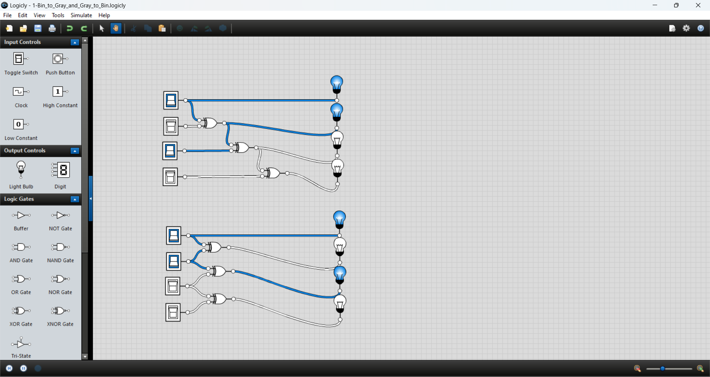
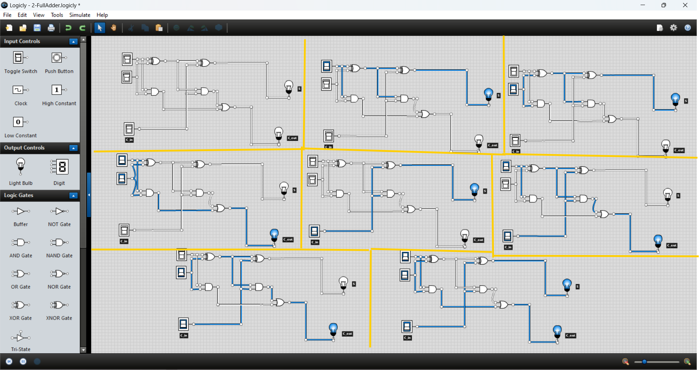
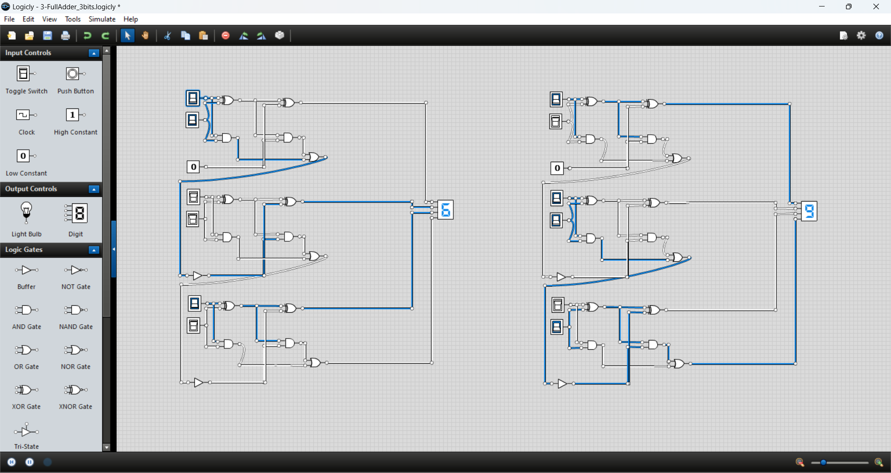

# **Digital Logic Design Report**

**Instructor:** Shima Tabibian  
**Course:** Principles of Computer Systems Laboratory  
**Academic Year:** 1402–1403  

---

## **1. Binary to Gray and Gray to Binary Converter**

This circuit converts a 4-bit binary number to Gray code and vice versa.  
- **Binary to Gray**: MSB remains unchanged; each next bit is the XOR of current and previous binary bit.  
- **Gray to Binary**: MSB remains unchanged; each next binary bit is the XOR of previous binary and current Gray bit.

> **Tested with two 4-bit inputs. Conversions were successful in both directions.**

---

## **2. Full Adder Design**

A full adder circuit was designed to add two bits and a carry-in. The outputs are a sum and a carry-out.

> **Verified over all 8 input combinations (A, B, Carry-in). All outputs matched expected values.**

---

## **3. 3-bit Binary Adder Using Full Adders**

Three full adders were chained to create a 3-bit binary adder. Each full adder processes corresponding bits and propagates carry.

> **Tested with two different 3-bit numbers. Final sum and carry-out were correct.**

---

## **Conclusion**

This lab project covered:
- Binary–Gray code conversion
- Full adder design and operation
- Building a multi-bit adder using chained full adders

All circuits were successfully implemented and tested using Logicly.
